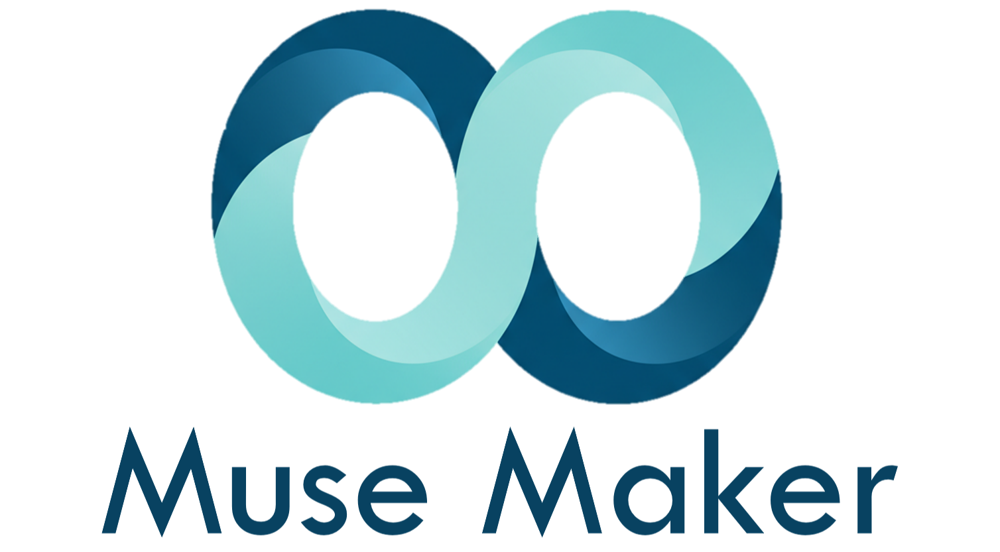
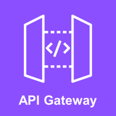
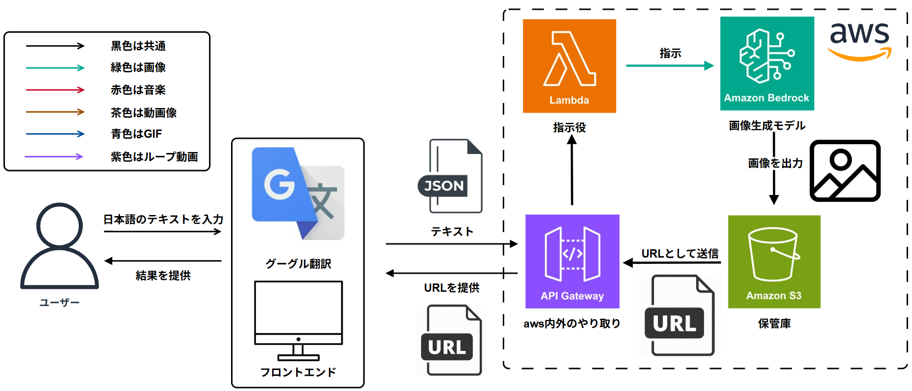
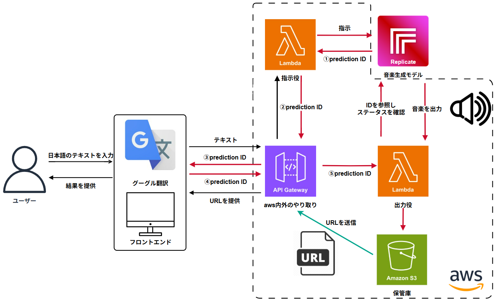
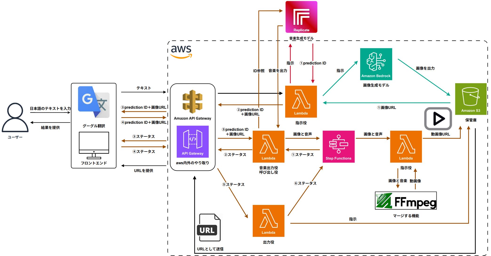
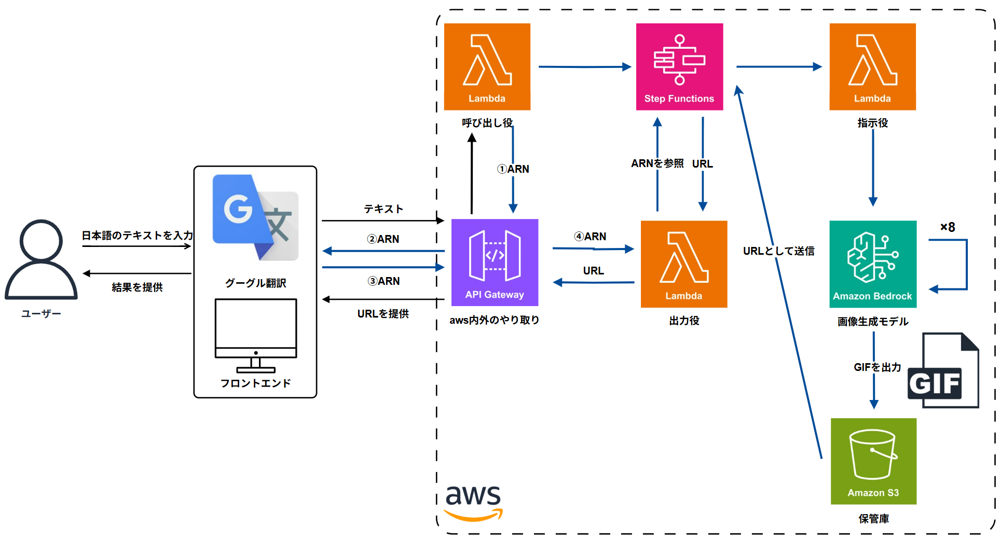
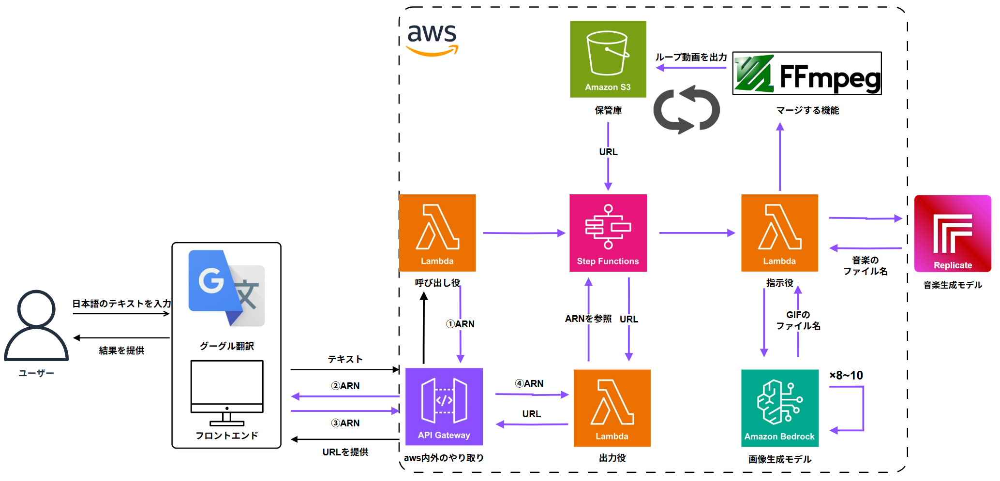

 

  

## アプリの概要
MuseMakerは、テキスト入力をもとに**画像・音楽・音楽付き静止画・GIF・ループ動画**を自動生成し、Web上で表示・再生できるアプリケーションです。

以下のコンテンツをすべてブラウザ上で生成・再生可能です：

- テキストから画像生成（text-to-image）
- テキストから音楽生成（text-to-music）
- テキストから音楽付き静止画生成（text-to-image-with-music）
- テキストからGIF生成（text-to-gif）
- テキストからループ動画生成（text-to-video）

---

## 作成した背景
近年、生成AI技術の進歩により、テキストから画像や音楽を生成するサービスは数多く登場しています。しかし、**2025年8月現在（個人調べ）、Web上でGIFアニメーションと音声を組み合わせた動画を自動生成できるサービスは存在しません**。

既存の動画編集ツールやアニメーション作成ソフトは、インストールや複雑な操作が必要で、初心者や非エンジニアにとってはハードルが高いものでした。

そこでMuseMakerは、以下の点を目的として開発されました：

- ブラウザ上だけで完結する簡単な操作性
- GIFと音声を合成した動画生成の自動化
- 画像・音楽・GIF・動画など複数形式のメディア生成を1つのUIに統合
- 個人でも気軽にミームやオリジナルコンテンツを作れる環境の提供

---

## デモ

以下のリンクでは、本アプリの**簡易版デモ**をご利用いただけます。  
※ 本システムは従量課金制のため、利用状況に応じて**開発者側に料金が発生**します。  
　そのため、課金を抑える目的で一部機能を制限しています。

👉 [https://muse-maker-free.netlify.app/](https://muse-maker-free.netlify.app/)

---

## 利用方法

1. 上記リンクにアクセスします。
2. テキストボックスに任意のプロンプト（例：「吠える犬」）を入力します。
3. 「送信」ボタンをクリックすると、以下のような結果が表示されます：
   - 画像が表示される
   - 音楽が再生される
   - 音楽付き静止画が表示される
   - GIFが再生される
   - GIF＋音楽を合成したループ動画が再生される
4. 必要に応じて、生成されたメディアをダウンロードすることもできます。

---

## 使用技術

| 区分 | 技術スタック |
|------|--------------|
| Front End | HTML / CSS / JavaScript / Netlify |
| Back End | Python / FFmpeg / Pillow |
| AI Model | Amazon Titan Image Generator v2 / Stable Diffusion   MusicGen / Riffusion |
| Cloud Service | AWS / Replicate |
| Other | VSCode / GitHub |

---

## 技術詳細

### 🔹 AWSサービス構成

- ### API Gateway
   

   - フロントエンドからのHTTPリクエストを受け取り、バックエンド（Lambda）にルーティング。
- ### Step Lambda
   
  
   - 各生成処理を非同期で実行（画像生成、音楽生成、GIF作成、動画合成など） 
- ### Step Functions
   

   - GIF＋音楽の合成やメディアの順序処理など、複数Lambda関数のワークフローを管理。
- ### Amazon S3
   
  
   - 生成された画像・音楽・動画を保存し、Webでのアクセスを可能に。

- ### Amazon Bedrock
   

   - Titan Image Generator v2を提供する生成AIプラットフォーム。

### 🔹 Replicate
さまざまな生成AIモデルをAPI経由で簡単に利用できるサービス。MusicGenをはじめとするAIモデルをノーコードで呼び出し可能。認証トークンとエンドポイントURLを使ってAPI操作。

### 🔹 Amazon Titan Image Generator v2 / Stable Diffusion
画像生成モデル。プロンプトに基づいてリアルで高解像度な画像を生成可能。

### 🔹 MusicGen / Riffusion
音楽生成モデル。プロンプトから自然な音楽を数秒～数分単位で生成可能で、スタイル指定やジャンル制御にも対応。

---

## システムの流れ

本システムは、入力されたテキストをもとに以下の5種類のメディアを生成します：

### ① テキストから画像生成（text-to-image）

#### 処理の流れ：

1. ユーザーが**日本語のテキスト**をフロントエンドで入力  
2. Google翻訳を使って**英語テキストに変換**  
3. JSON形式でテキストをAPI Gateway経由で送信  
4. Lambda関数が**Amazon Bedrock**に指示を送り、**AMAZON Titan Image Generator v2**を呼び出す  
5. 生成された画像が**Amazon S3に保存**  
6. 画像のURLをフロントエンドに返却し、Web上で表示  

### ② テキストから音楽生成（text-to-music）

#### 処理の流れ：

1. ユーザーが**日本語のテキスト**をフロントエンドで入力  
2. Google翻訳を使用して**英語テキストに変換**  
3. JSON形式でテキストをAPI Gateway経由で送信   
4. Lambda関数が**Replicate API**経由で**MusicGenモデル**を呼び出し、生成処理を開始  
5. Lambdaが発行された `prediction ID` を元にステータス確認 → 音楽生成が完了  
6. 音楽ファイルを**Amazon S3に保存**  
7. 音楽ファイルのURLをフロントエンドに返却し、Web上で再生  

### ③ テキストから音楽付き静止画生成（text-to-image-with-music）

#### 処理の流れ：

1. ユーザーが**日本語テキスト**をフロントエンドで入力 
2. Google翻訳を使用して**英語テキストに変換**  
3. フロントエンドから**API Gateway → Lambda(A)** に送信  
4. **Lambda(A)** が並行に処理：  
   - **Replicate API / MusicGen** で音楽生成を開始し、`prediction ID` を取得  
   - **Amazon Bedrock / Titan Image Generator v2** で静止画像を生成 → **Amazon S3** に保存 → **画像URL** を取得  
   - フロントエンドへ **`画像URL`** と **`prediction_id`** を返却  
5. フロントエンドは定期的に **API Gateway → Lambda(B)** に **`prediction_id` と `画像URL`** を送信し、音楽生成の進行状況を確認  
6. **Lambda(B)** が **Replicate API** でステータス確認 → 完了時に音楽ファイルを取得 → **S3 に保存** → **音楽URL** を取得  
7. **Lambda(B)** が **Step Functions** を起動（入力：`画像URL`, `音楽URL`）  
8. **Step Functions → Lambda(C)**：S3から画像と音声をダウンロードし、**FFmpeg** で**静止画像＋音声のMP4動画**を生成 → **S3 にアップロード** → **動画URL** を返却  
9. フロントエンドは **API Gateway → Lambda(D)** に **実行ARN** を渡してそれを元にステータス確認 → **動画URL** を受け取る  
10. 返却された **動画URL** をブラウザで再生  

### ④ テキストからGIF生成（text-to-gif）

#### 処理の流れ：

1. ユーザーが**日本語テキスト**をフロントエンドで入力 
2. Google翻訳を使用して**英語テキストに変換** 
3. フロントエンド → **API Gateway → Lambda(A)** に送信  
   - **Step Functions の実行を開始**し、**実行ARN** を返却  
4. **Step Functions** がオーケストレーションし、**Lambda(B)** を実行：  
   - 各フレームで **Amazon Bedrock / Amazon Titan Image Generator v2** を呼び出し  
   - 生成画像を結合して **GIF を作成**（Pillow使用）  
   - **S3 にアップロード**し **GIFURL** を返す  
5. フロントエンドは **実行ARN** を使って **API Gateway → Lambda(C)** へ状態確認  
6. 受け取った **GIFURL** をブラウザで表示

### ⑤ テキストからループ動画生成（text-to-video）

#### 処理の流れ：

1. ユーザーが**日本語テキスト**をフロントエンドで入力
2. Google翻訳を使用して**英語テキストに変換** 
3. フロントエンド → **API Gateway → Lambda(A)** に送信  
   - **Step Functions** の実行を開始し、**実行ARN** を返却  
4. **Step Functions** がオーケストレーションし、**Lambda(B)** を実行（並列処理）：  
   - **音楽生成（バックグラウンドスレッド）**  
     - **Replicate / Riffusion** を呼び出し音楽生成を開始  
     - **ステータスをポーリング**し、**成功時に音楽ファイルを取得**  
   - **GIF生成**  
     - 各フレームで **Amazon Bedrock / Amazon Titan Image Generator v2** を呼び出し画像を生成  
     - 生成フレームを結合して **GIF** を作成  
   - **合流 & マージ**  
     - **FFmpeg** で **GIF + 音楽** を結合し **ループ動画（MP4）** を生成  
     - 生成した動画を **Amazon S3 にアップロード** → **`動画URL`** を取得  
5. フロントエンドは **実行ARN** を使って **API Gateway → Lambda(C)** に状態確認   
6. 受け取った **動画URL** をブラウザで再生（ループ再生可）

---

## チームメンバー

| 名前 | GitHubアカウント |
|------|------------------|
| Anan Eguchi | [https://github.com/anan0105](https://github.com/anan0105) |
| Shuichiro Nomura | [https://github.com/Shuichiro-labo](https://github.com/Shuichiro-labo) |
| Ryuta Sugai | [https://github.com/Ryuta-work](https://github.com/Ryuta-work) |

---

## お問い合わせ

何かご不明な点がありましたら、GitHub Issues にてご連絡ください。
